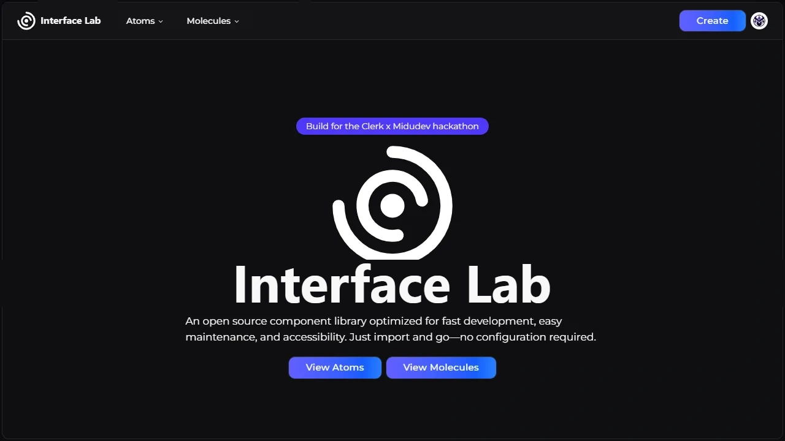
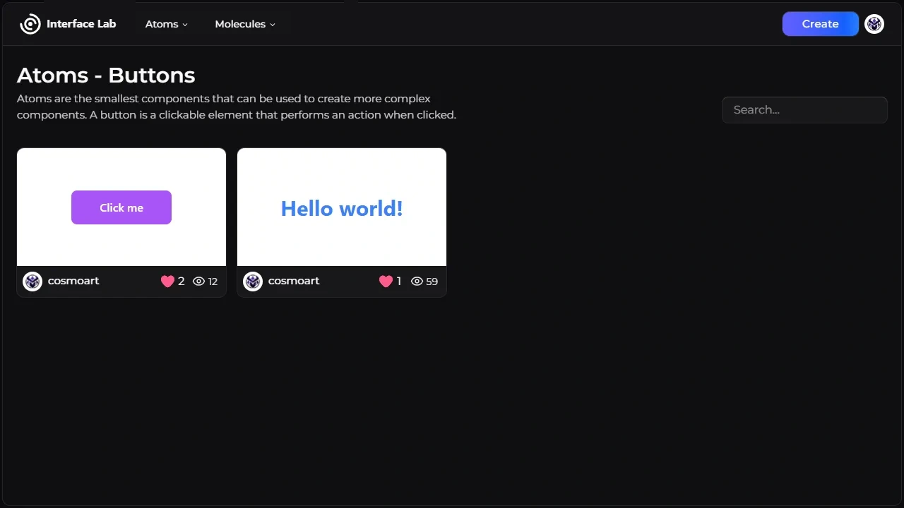
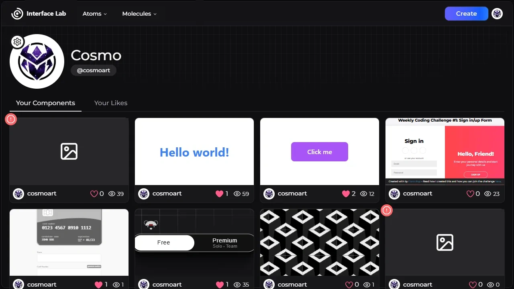
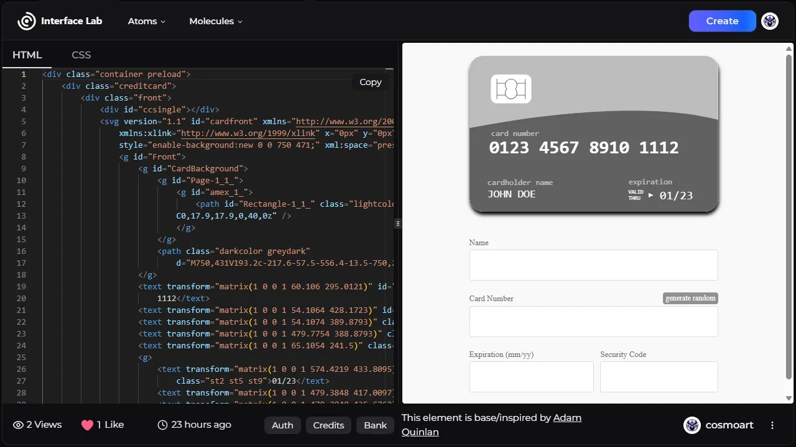

<div id="top"></div>

<div align="center">
<a href="https://atomox.vercel.app"></a>
<br/>
<br />

**A place to share and discover reusable UI components.**

  <a href="https://atomox.vercel.app">Open the website</a>
</div>

<br />

## What is Atomox?

Atomox is a website where you can browse ready-made UI pieces — buttons, cards, forms, and other small ("atoms") and larger ("molecules") components — built with HTML, CSS, and JavaScript. You can preview how each one looks and works, copy the code, and use it in your own projects.

You can also sign in and share your own components for others to use.

<p align="right"><a href="#top">⬆️ Back to top</a></p>


<!-- SCREENSHOTS -->
## 📸 Screenshots

<table>
    <tr>
      <td>
          
      </td>
      <td>
          
      </td>
    </tr>
        <tr>
      <td>
          
      </td>
      <td>
          
      </td>
    </tr>
</table>

<p align="right"><a href="#top">⬆️ Back to top</a></p>

### 🛠️ Built With

List of the frameworks, libraries and tools used to build this project.

* [Clerk](https://clerk.com/) For authentication
* [Next.js](https://nextjs.org/)
* [Supabase](https://supabase.com/) For database & storage
* [React.js](https://reactjs.org/)
* [shadcn/ui](https://ui.shadcn.com/) For the design system
* [React Monaco Editor](https://github.com/suren-atoyan/monaco-react) For the code editor
* [Lucide](https://lucide.dev/) For icons
* [Vercel](https://vercel.com/) For hosting
* [Tailwind CSS](https://tailwindcss.com/) For styling
* [Figma](https://www.figma.com/) For layouts and design
* [Canvas confetti](https://www.npmjs.com/package/canvas-confetti) For the confetti animation
* [React Hook Form](https://react-hook-form.com/) For form validation
* [Zod](https://zod.dev/) For form validation
* [next-themes](https://github.com/pacocoursey/next-themes) For dark mode

<p align="right"><a href="#top">⬆️ Back to top</a></p>


<!-- GETTING STARTED -->
## ⚙️ Getting Started

1. Clone or fork the repo
```sh
git clone https://github.com/cosmoart/atomox
```
1. Install NPM packages
```sh
npm install
```
3. Run the project
```sh
npm run dev
```

<p align="right"><a href="#top">⬆️ Back to top</a></p>


<!-- ROADMAP -->
## 🎯 Roadmap

Proposed features that may or may not be implemented in the future.

- [x] Comments section
- [ ] User achievements, description & links.
- [ ] Components from other frameworks (React, Vue, Angular, etc.)
- [ ] Tailwind autocomplete
- [x] Verified user role ~~(Its components are published immediately.)~~
- [x] Licenses or credits for the components
- [ ] ~~Zoom in/out in components~~

<p align="right"><a href="#top">⬆️ Back to top</a></p>

<!-- LICENSE -->
## 📜 License

Distributed under the Apache License 2.0. See [`LICENSE.txt`](https://github.com/cosmoart/atomox/blob/main/LICENCE) for more information.

<p align="right"><a href="#top">⬆️ Back to top</a></p>

<!-- CONTACT -->
## 📩 Contact

-   My website - [cosmoart.dev](https://cosmoart.dev)
-   Twitter - [@cosmoart0](https://twitter.com/cosmoart0)
-   Instagram - [@cosmoart0](https://www.instagram.com/cosmoart0/)

<p align="right"><a href="#top">⬆️ Back to top</a></p>
